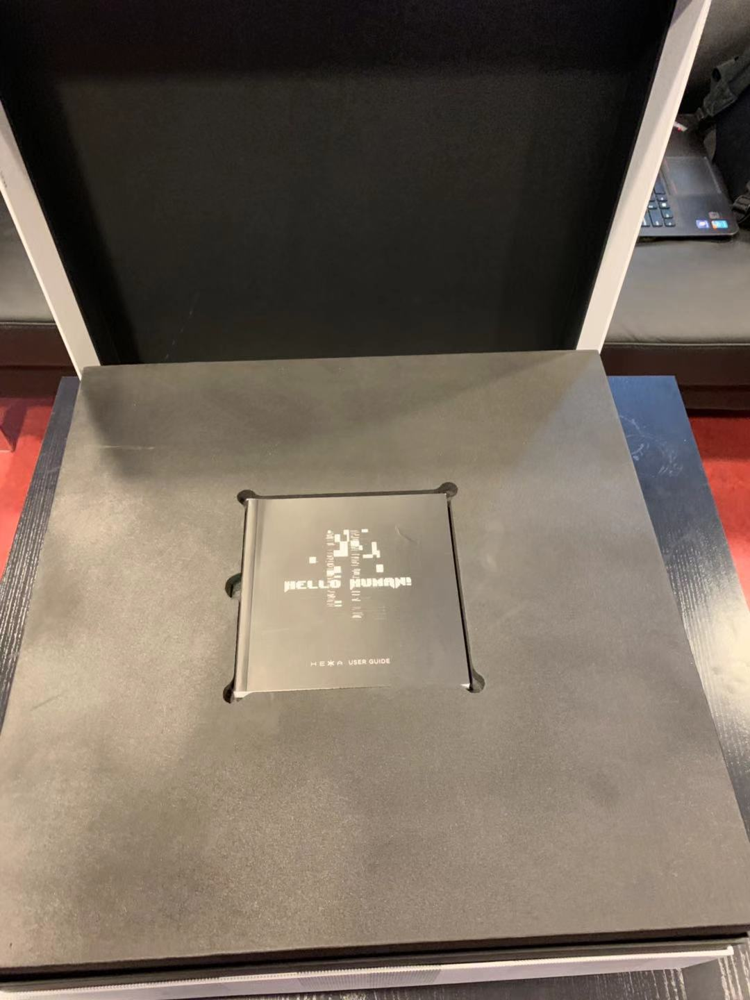
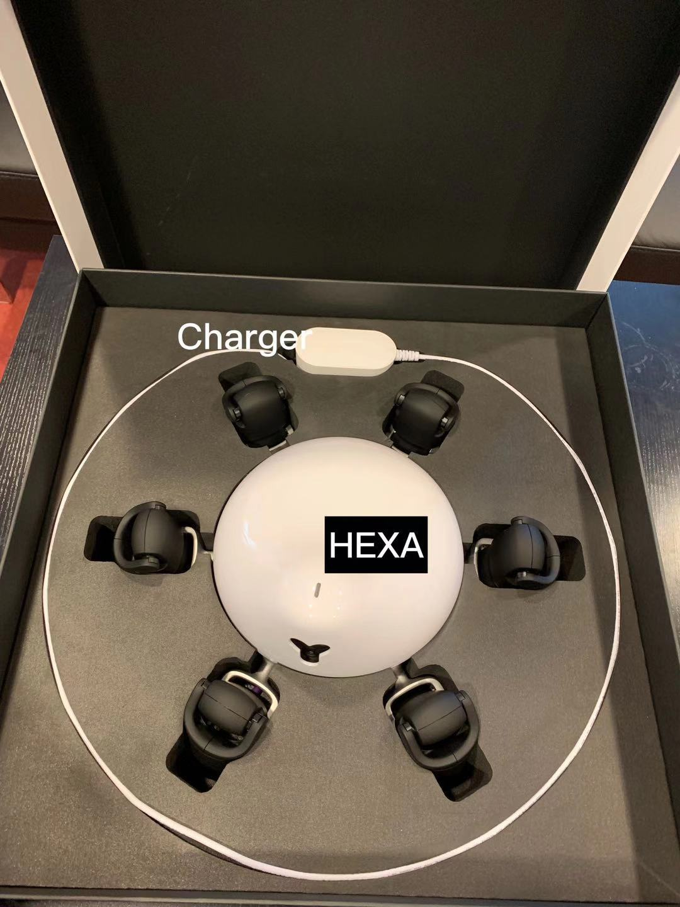

# Hexa Robot

HEXA is an all-terrain hexapod robot designed and developed by Vincross Inc. It comes equipped with basic motion capacities such as walking, climbing, and passing through caves. It is also equipped with multiform interfaces such as a built-in camera, infrared transmitter, and a distance measuring sensor. Furthermore, HEXA is running MIND, a Linux-based OS,
which allows developers to easily program their robot. Various hardware ports are available including USB, audio input and output, I²C, ADC, GPIO, and 5V/3.3V power output.

## Content

* [Where To Find](#where-to-find)
* [In The Box](#in-the-box)
* [How To Make It Works](#how-to-make-it-works)
  * [Charging The Batteries](#charging-the-batteries)
  * [Powering Up](#powering-up)
* [Device's Functionalities and Features](#device's-functionalities-and-features)
* [SDK](#sdk)
  * [Become A Developer](#becaome-a-developer)
* [Putting The Device Back](#putting-the-device-back)
* [More Documentations](more-documentations)


## Where To Find

Storage room - shelve A1

## In The Box

Here you can see the included components and their locations.
1. Instruction
2. Charger
3. Hexa Robot




## How To Make It Works

### Activation
Activation is required only once when the device is first used, after that you just need to follow the instructions on how to connect it to your mobile. If the device is already activated you can move on to the next section.

1. Download HEXA App for your mobile device from [here](https://www.vincross.com/download-hexa-app), upon downloading, you will be guided through setup and on-boarding. You must have a Wi-Fi network to provide an internet connection for both your HEXA and mobile device during initial setup.
2. Open HEXA App while your mobile device is connected to a Wi-Fi network, and press "Let's get started!"
3. Turn on HEXA’s power button located on its posterior side. The power light will turn a steady green to indicate it is on.
4. The head light on the top side will show light purple for about 10 seconds. Then it will start blinking yellow.
5. Choose a Wi-Fi network for HEXA and enter the password.(Note: HEXA is NOT able to connect to any of the wireless network that is: 5GHz, enterprise secured, ad-hoc/peer-to-peer, or public networks that require a web browser for authentication.)
6. Place the QR code in front of HEXA's camera until the head light turns blue and stops blinking. Try to move slightly for focus. After wait about 30-60 seconds, the HEXA App will automatically connect the HEXA once activation complete.


### Connect to HEXA with your mobile device
There are two ways to connect HEXA to your mobile device.
1. Wi-Fi mode (connect through the internet or LAN)
2. Direct Link mode

#### Using Wi-Fi mode to connect HEXA
When your mobile device is connecting to HEXA using Wi-Fi, HEXA will automatically determine whether the current network environment is LAN or internet.
1. When HEXA and your mobile device are connected to the same Wi-Fi network, HEXA will appear as a LAN connection.
2. When HEXA and your mobile device are connected to different Wi-Fi networks, HEXA will appear as an internet connection
Follow the steps below to connect:
1. Turn on HEXA’s power button. Its head light will blink blue, which shows it is connecting to Wi-Fi.
2. Connect mobile device to Wi-Fi network with internet access, and then open the HEXA App.
3. Refresh the HEXA list, you will see your HEXA with an LAN connection icon or Internet connection icon. Press the HEXA's name, then the HEXA App will connect to this HEXA and display the Launcher.

#### Using Direct link Mode to connect to HEXA.
Direct Link mode is designed for outdoor use or for environments where no Wi-Fi network exists. Under Direct Link mode, HEXA becomes a Wi-Fi hotspot. Once your mobile device connects to this hotspot, it can connect to HEXA through the HEXA App.
Follow the steps below to connect:
1. When you turn on HEXA and there is no available Wi-Fi network, the head light will shortly appear light purple before it blinks yellow, and it will finally stay in steady purple light. You are able to connect with HEXA using Direct Link mode when the head light is yellow or purple. (Note ：Even when HEXA is connected to Wi-Fi, you can switch to Direct Link mode by visiting "Settings" in the HEXA App.)
2. Open your mobile device’s network settings. Among the available networks, select the network that is named HEXA-followed by a 12-digit number combination. Press “Connect” and enter the password which is the last 8 digits of the network name.
3. Open HEXA App. The icon indicates HEXA is under Direct Link mode. Click the HEXA's name and connect to it. You will then be able to enter HEXA Launcher.


## Device's Functionalities and Features
This robots functionalities are presented as skills. A “Skill” is an application of HEXA. It is the equivalent to a software of an app on a mobile device.

+ HEXA Pre-installed Skills: there are three preinstalled skills on Hexa which are Explore, Dance and Simulator Kit.
  * Explore enables HEXA to remotely explore its surroundings, as well as transmit the images it sees.
  * Dance enables HEXA to dance. You can let your creative ideas flow by utilizing avariety of motions.
  * Simulator Kit enables HEXA to synchronize with HEXA Simulator. You can design new Motions for HEXA.

+ Download more Skills: HEXA is an open platform. We welcome you to share your inspirations and publish your own Skills. You can also enter the Skill Store from within the HEXA App to browse and download additional Skills, giving HEXA more capabilities and possibilities

## SDK

### MIND SDK
HEXA’s operating system is called MIND. With MIND SDK, developers will be able to develop Skills for HEXA and empower it to do almost anything you can imagine. Visit [Vincross Developer Center](https://developer.vincross.com/developer/introduction/mind-overview) for more information about MIND SDK, its documentation, and tutorials

#### Windows

1. Install Docker: Vincross uses Docker in order to manage the SDK libraries and dependencies. If you don't have Docker you can download it using these [instructions](https://docs.docker.com/engine/installation/).
2. Download the windows version of [MIND](https://cdn-static.vincross.com/downloads/mind/latest/windows-x86_64/mind.exe)
3. Run Powershell as Administrator
4. Copy mind.exe into your PATH
   ```
    $ Copy c:\directory\where\mind\downloaded\in\step\2\mind.exe .
   ```
5. Execute mind upgrade. This pulls all the needed dependencies from Docker. The first time you run it, it may take a while
   ```
   $ mind upgrade
   ```
6. Open Windows Firewall and allow incoming ports TCP/8888 and TCP/7597
   1. Add inbound rule
   2. Select TCP
   3. Specify local ports: 8888
   4. Repeat the previous steps and create new rule for the other port number 7597
7. Now you will be able to use mind from your Powershell account.
8. Finally, you'll need to configure mind to use your [Developer Bridge](https://developer.vincross.com/bridge) account. If you don't have an account you can create an account by going [here](https://www.vincross.com/en/login?back=https%3A%2F%2Fdeveloper.vincross.com%2Fen%2F)
    ```
    $ mind login <youremail> <yourpassword>
    ```

#### MacOS and Linux
1. Install Docker: Vincross uses Docker in order to manage the SDK libraries and dependencies. If you don't have Docker you can download it using these [instructions](https://docs.docker.com/engine/installation/).
2. Install mind sdk by downloading it and making it excutable by running the commands below
        ```
        $sudo curl -o /usr/local/bin/mind https://cdn-static.vincross.com/downloads/mind/latest/mind-`uname -s`-`uname -m`
        $sudo chmod +x /usr/local/bin/mind
        ```
3. Now you can run mind by typing mind in the terminal and you will get a list of available commands
```
$ mind
MIND Command-line Interface v0.5.3

Usage:
  mind [command]

Available Commands:
  build                Build a Skill
  flight-test          Flight test a Skill on mobile device
  get-default-robot    Returns the name of the default robot
  get-default-robot-ip Returns the IP of the default robot
  init                 Initialize and scaffold a new Skill
  login                Authenticate yourself
  pack                 Pack a Skill
  run                  Run Skill on robot
  scan                 Scan your network or specific IP for robots
  set-default-robot    Set the default robot name
  upgrade              Upgrades mindcli container to latest version
  x                    Run a command inside of a cross-compiling capable docker container

Use "mind [command] --help" for more information about a command.
```

To get help for any command you can run mind [command] --help for example
```
$ mind upgrade --help
Upgrades mindcli container to latest version

Usage:
  mind upgrade [flags]
```
4. Install and initialize MIND CLI Docker image by simply running the command mind upgrade in the terminal
```
$ mind upgrade
```
5. Configure mind to use your [Developer Bridge](https://developer.vincross.com/bridge) account
```
$ mind login <youremail> <yourpassword>
```
6. After you've initialized the mind CLI, you can start creating [your first Skill](https://documentation.vincross.com/Development/yourfirstskill.html).

### Example Skills

[Here](https://documentation.vincross.com/Development/exampleskills.html) is a list of skills example code with tutorial you can follow to build your first skill.

### MIND Studio
To create skills for MIND platform you will need MIND Studio which is available for download for Windows, MacOS and Linux.


To get started you will need to visit the [developer website](https://developer.vincross.com/en) and create an account.
